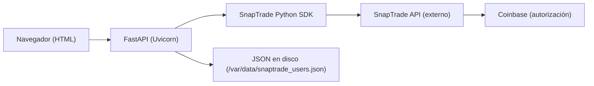

## 1. Diseño de Arquitectura
La solución es un backend web (FastAPI) que sirve HTML embebido y orquesta llamadas al SnapTrade Python SDK. La persistencia se realiza en un archivo JSON en disco, compatible con Render Disk.



## 2. Descripción Tecnológica
- Backend: Python + FastAPI + Uvicorn
- SDK: snaptrade-python-sdk (importar como `from snaptrade_client import SnapTrade`)
- Configuración: python-dotenv para variables de entorno
- Persistencia: archivo JSON (filesystem), apuntando a `/var/data` en Render

## 3. Definición de Rutas
| Ruta | Propósito |
|------|----------|
| GET / | Página principal (lista usuarios + formularios) |
| POST /register-user | Registrar usuario SnapTrade y persistirlo |
| POST /connect-coinbase | Iniciar flujo de conexión con Coinbase (redirect) |
| GET /callback | Procesar retorno de SnapTrade y persistir connection_id |
| GET /dashboard/{user_id} | Dashboard por usuario |
| GET /health | Healthcheck para Render |

## 4. Definiciones de API (Backend)

### 4.1 POST /register-user
- Request (form):
  - user_id: string
- Response:
  - HTML con resultado (éxito o error)

### 4.2 POST /connect-coinbase
- Request (form):
  - user_id: string
- Proceso:
  - login_snap_trade_user(user_id, user_secret, broker="COINBASE", connection_type="trade")
  - Extraer redirect_uri desde `.body` o propiedades equivalentes
- Response:
  - Redirect HTTP 302 al Connection Portal

### 4.3 GET /callback
- Query params:
  - status: string
  - connection_id: string
- Side effects:
  - Asocia connection_id al `pending_user_id` global
  - Actualiza last_connected

## 5. Modelo de Datos

### 5.1 Estructura Persistida (JSON)
Llave principal por user_id:
```json
{
  "user_id": {
    "user_secret": "uuid",
    "created_at": "ISO-8601",
    "connections": ["conn_xxx"],
    "last_connected": "ISO-8601"
  }
}
```

### 5.2 Reglas
- created_at se setea al registrar el usuario.
- last_connected se setea al recibir callback SUCCESS.
- connections es lista única (evitar duplicados).
- En plan gratuito de SnapTrade, registrar >1 usuario puede fallar; se muestra mensaje amigable.
