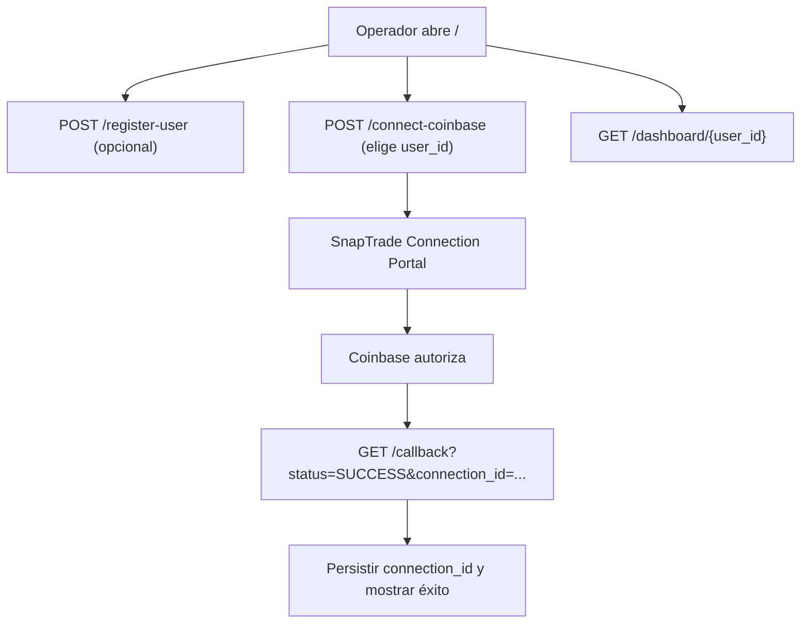

## 1. Visión General del Producto
Aplicación web con FastAPI que permite a varios usuarios administrar su identidad de SnapTrade y conectar su cuenta de Coinbase mediante el portal de conexión de SnapTrade, guardando conexiones de forma persistente en disco.
- Resuelve la necesidad de “conectar y recordar” conexiones Coinbase sin intervención manual del operador.
- Aporta un link único (deploy) para que clientes finales completen el flujo de conexión.

## 2. Funcionalidades Principales

### 2.1 Roles de Usuario
| Rol | Método de acceso | Permisos principales |
|-----|------------------|----------------------|
| Operador (admin simple) | Acceso por URL | Registrar usuarios SnapTrade, iniciar conexiones Coinbase, ver dashboards |
| Cliente final (Coinbase) | Portal SnapTrade (redirect) | Autorizar la conexión en Coinbase y volver al callback |

### 2.2 Módulos por Página
1. **Inicio (/)**: lista de usuarios guardados, registro de nuevo usuario, selección de usuario para conectar Coinbase.
2. **Callback (/callback)**: procesamiento del retorno del portal de conexión y guardado de connection_id.
3. **Dashboard (/dashboard/{user_id})**: detalle del usuario, conexiones, última conexión.
4. **Salud (/health)**: endpoint para monitoreo.

### 2.3 Detalle de Páginas
| Página | Módulo | Descripción |
|-------|--------|-------------|
| / | Lista de usuarios | Muestra userId, created_at, cantidad de conexiones, link al dashboard |
| / | Registro | Formulario POST /register-user con user_id |
| / | Conectar Coinbase | Formulario POST /connect-coinbase con user_id |
| /callback | Resultado | Lee status y connection_id; persiste connection si SUCCESS |
| /dashboard/{user_id} | Detalle | userId, userSecret oculto parcial, conexiones, last_connected |
| /health | Healthcheck | Devuelve {"status":"ok"} |

## 3. Proceso Principal
Flujo de registro y conexión:
1) Operador registra usuario SnapTrade.
2) Operador inicia “Conectar Coinbase” para un user_id.
3) App llama login_snap_trade_user y redirige al portal de SnapTrade.
4) Cliente autoriza en Coinbase y SnapTrade redirige a /callback.
5) App guarda connection_id asociado al último user_id “pendiente” y muestra éxito.

## 4. Diseño de Interfaz
### 4.1 Estilo Visual
- Enfoque utilitario (admin minimalista), HTML embebido, formularios simples y mensajes claros.
- Tipografía del sistema, layout centrado y tarjetas básicas.
- Mensajes de error/éxito destacados.

### 4.2 Resumen UI por Página
| Página | Módulo | Elementos UI |
|-------|--------|--------------|
| / | Lista | Tabla simple, links a dashboard |
| / | Formularios | Inputs, selects, botones, mensajes de estado |
| /callback | Resultado | Bloque de éxito/error y link de regreso |
| /dashboard/{user_id} | Detalle | Lista de conexiones, timestamps |

### 4.3 Responsividad
Desktop-first con adaptación móvil sencilla (contenedor max-width, tabla con overflow horizontal si hace falta).
